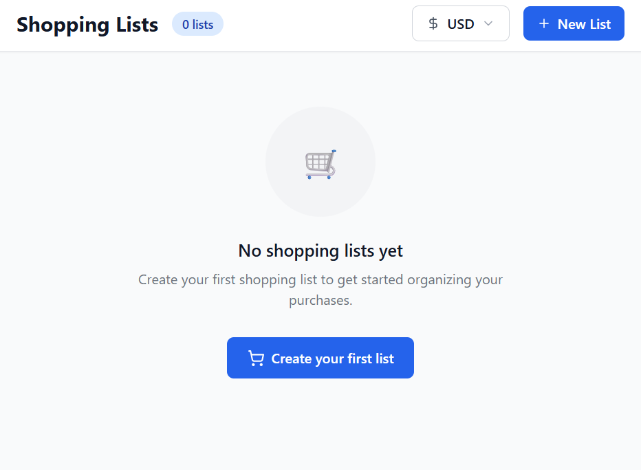

# 🛒 Lista de Compras Inteligente



Una aplicación web moderna y responsiva desarrollada con **React** y **Tailwind CSS**, que te permite crear, organizar y gestionar múltiples listas de compras de forma clara, eficiente y profesional. Ideal para quienes buscan ahorrar tiempo y mantener sus compras bien planificadas.

---

## ✨ Funcionalidades

- 📝 **Múltiples listas**: Crea listas con títulos personalizados, al estilo de Samsung Notes.
- 🛍 **Agrega productos fácilmente**: Añade artículos con nombre y precio.
- 💲 **Cálculo automático**: Suma los precios de los productos por lista.
- 🌎 **Soporte de monedas**: Cambia entre USD, EUR y otras monedas.
- ✅ **Productos pendientes o comprados**: Marca productos como completados.
- 🎨 **Diseño profesional**: Interfaz moderna, responsiva y con animaciones suaves.

---

## 🛠️ Tecnologías Utilizadas

| Herramienta       | Descripción                                                        |
|-------------------|--------------------------------------------------------------------|
| ⚛️ React           | Librería para construir interfaces de usuario                     |
| 🎨 Tailwind CSS    | Framework de estilos con clases utilitarias y diseño moderno      |
| ⚡ Vite            | Herramienta rápida de desarrollo y empaquetado                    |
| 🗃 Git + GitHub     | Control de versiones y publicación del proyecto                   |

---

## 🚀 Instalación y Ejecución Local

Sigue estos pasos para clonar y ejecutar la app en tu máquina local:

`1.`. Clona el repositorio:

```bash
git clone https://github.com/alejandracode/lista-de-compras.git
```

`2.`. Accede al directorio:

```bash
cd lista-de-compras
```

`3.`. Instala las dependencias

```bash
npm install
```

`4.`. Inicia la app

```bash
npm run dev
```

`5.`. Visita http://localhost:5173 en tu navegador.

## 👩‍💻 Autora
Alejandra Girón

📧 alejandragironmira@gmail.com

💻 GitHub: alejandracode
